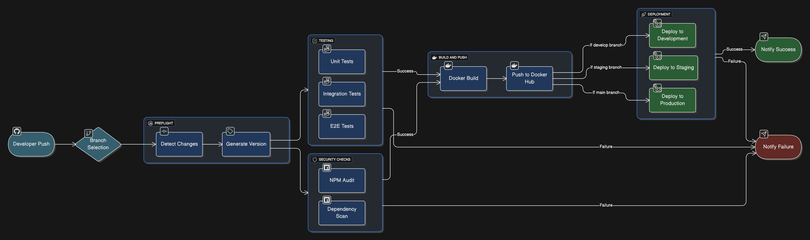

# 🚀 Roxs Stack DevOps CI/CD - Proyecto Completo de Pipeline

[](https://hub.docker.com/r/roxsross12/roxs-stack-devops-cicd)
[](https://nodejs.org/)
[](https://github.com/roxsross)

[](https://github.com/roxsross/devops-roxs-node-github/actions)
[](https://coveralls.io/github/roxsross/devops-roxs-node-github)
[](LICENSE)
[](https://github.com/roxsross/devops-roxs-node-github/commits/main)
[](https://github.com/roxsross/devops-roxs-node-github/issues)
[](https://github.com/roxsross/devops-roxs-node-github/stargazers)

## 📋 Descripción


Stack DevOps completo demostrando mejores prácticas de CI/CD usando:
- **Node.js + Express** como framework backend
- **HTML/CSS/JavaScript** moderno para el frontend
- **GitHub Actions** para automatización CI/CD con **workflows reutilizables**
- **Docker multi-stage** para contenerización optimizada
- **Multi-ambientes** (dev, staging, prod) con configuraciones específicas
- **Docker Hub** como registro y despliegue final
- **Telegram** para notificaciones automáticas en tiempo real
- **Testing integral** con Jest y Supertest
- **Escaneo de seguridad** con npm audit y Snyk
- **Calidad de código** con ESLint y Prettier
- **Monitoreo de performance** con métricas avanzadas



## 🏗️ Arquitectura del Proyecto


```
roxs-stack-devops-cicd/
├── src/                     # Código fuente Node.js/Express
│   ├── app.js              # Aplicación principal Express
│   ├── routes/             # Rutas API
│   ├── controllers/        # Controladores de negocio
│   ├── middleware/         # Middlewares personalizados
│   ├── utils/              # Utilidades y helpers
│   └── config/             # Configuraciones de entorno
├── public/                  # Recursos estáticos (HTML, CSS, JS)
│   ├── index.html          # Página principal del dashboard
│   ├── css/                # Estilos CSS
│   ├── js/                 # JavaScript frontend
│   └── assets/             # Imágenes y recursos
├── tests/                   # Pruebas automatizadas
│   ├── unit/               # Pruebas unitarias
│   ├── integration/        # Pruebas de integración
│   └── e2e/                # Pruebas end-to-end
├── docker/                  # Configuraciones Docker
│   ├── Dockerfile          
```

## 🚀 Características Principales

- ✅ **CI/CD completo** con GitHub Actions y múltiples etapas
- ✅ **Multi-ambiente** (Desarrollo, Staging, Producción)
- ✅ **Containerización avanzada** con Docker multi-stage
- ✅ **Registro automatizado** en Docker Hub con tagging inteligente
- ✅ **Testing integral** con reportes de cobertura
- ✅ **Escaneo de seguridad** automático con varias herramientas
- ✅ **Calidad de código** con linting y formateo automático
- ✅ **Notificaciones Telegram** para todos los eventos
- ✅ **Monitoreo de performance** con métricas en tiempo real
- ✅ **Health checks** avanzados con endpoints dedicados
- ✅ **Hot reload** para desarrollo ágil
- ✅ **Documentación API** con Swagger/OpenAPI
- ✅ **Logging estructurado** con Winston
- ✅ **Manejo de errores** robusto y centralizado

## 🔧 Configuración Inicial

### 1. Variables de entorno requeridas en GitHub Secrets:

```bash
DOCKER_USERNAME=tu_usuario_dockerhub
DOCKER_PASSWORD=tu_password_dockerhub
TELEGRAM_TOKEN=tu_bot_token
TELEGRAM_CHAT_ID=tu_chat_id
```

### 2. Ejecutar localmente:

```bash
# Clonar el repositorio
git clone https://github.com/roxsross/devops-roxs-node-github.git
cd devops-roxs-node-github

npm install
npm run dev

```

## 🌐 Endpoints de la API

### Endpoints Core:
- `GET /` - Página principal con dashboard interactivo
- `GET /health` - Health check avanzado con dependencias
- `GET /api/status` - Estado detallado de la aplicación
- `GET /api/version` - Información de versión y build
- `GET /api/metrics` - Métricas de performance y sistema

### Endpoints de Negocio:
- `GET /api/users` - Gestión de usuarios (demo)
- `POST /api/users` - Crear nuevo usuario
- `GET /api/data` - Operaciones CRUD de datos
- `POST /api/data` - Crear nuevos datos
- `GET /api/logs` - Logs de aplicación (admin)

### Endpoints Admin:
- `GET /admin` - Panel de administración
- `GET /api/admin/stats` - Estadísticas avanzadas
- `POST /api/admin/cache/clear` - Limpiar caché

## 🔄 Flujo CI/CD Avanzado

1. **Calidad de código** → ESLint, Prettier, auditoría de seguridad
2. **Testing suite** → Unitarias + Integración + E2E
3. **Build & Optimize** → Build Docker multi-stage optimizado
4. **Escaneo de seguridad** → Vulnerabilidades y dependencias
5. **Pruebas de performance** → Load testing básico
6. **Push a registro** → Docker Hub con múltiples tags
7. **Simulación de despliegue** → Según ambiente
8. **Verificación de salud** → Post-deploy
9. **Notificación** → Telegram con métricas detalladas

## 📊 Ambientes y Estrategia

### 🧪 Desarrollo
- **Disparador**: Push a la rama `develop`
- **Características**: Hot reload, modo debug, datos mock
- **Despliegue**: Automático sin aprobación
- **URL**: `http://localhost:3000`

### 🎭 Staging  
- **Disparador**: Push a la rama `staging`
- **Características**: Similar a producción, datos de test
- **Despliegue**: Automático con smoke tests
- **URL**: `https://staging.devops-roxs-node.com`

### 🚀 Producción
- **Disparador**: Push a la rama `main`
- **Características**: Optimizado, monitoreo completo
- **Despliegue**: Aprobación manual + rollback automático
- **URL**: `https://devops-roxs-node.com`

## 📱 Sistema de Notificaciones Telegram

Notificaciones inteligentes para:
- 🚀 **Deploy iniciado** con información del commit
- ✅ **Deploy exitoso** con métricas de performance
- ❌ **Deploy fallido** con logs de error específicos
- ⚠️ **Alertas de seguridad** ante vulnerabilidades
- 📊 **Reportes de tests** con cobertura y estadísticas
- 🔄 **Estado del pipeline** en cada etapa importante
- 💾 **Backup completado** de datos críticos

## 🛠️ Stack Tecnológico

### Backend:
- **Node.js 18+** - Runtime JavaScript
- **Express.js** - Framework web minimalista
- **Morgan** - Logger de peticiones HTTP
- **Helmet** - Middleware de seguridad
- **CORS** - Compartición de recursos entre orígenes
- **Compression** - Compresión de respuestas
- **Winston** - Logging avanzado

### Frontend:
- **HTML5** - Estructura semántica
- **CSS3** - Estilos modernos con Flexbox/Grid
- **Vanilla JavaScript** - Interactividad sin frameworks
- **Chart.js** - Gráficos y visualizaciones
- **Bootstrap 5** - UI responsive

### DevOps:
- **Docker** - Containerización
- **GitHub Actions** - Pipeline CI/CD
- **Jest** - Framework de testing
- **Prettier** - Formateo de código


## 📊 Métricas y Monitoreo

- **Performance**: Tiempo de respuesta, throughput, tasa de errores
- **Salud**: CPU, memoria, uso de disco
- **Negocio**: Actividad de usuarios, uso de API, errores
- **Seguridad**: Logins fallidos, actividad sospechosa

## 🔐 Seguridad

- **Dependencias**: Escaneo automático de vulnerabilidades
- **Código**: Análisis estático con reglas de seguridad ESLint
- **Runtime**: Encabezados de seguridad con Helmet.js
- **Secrets**: GitHub Secrets para información sensible
- **Docker**: Usuario no-root, superficie de ataque mínima

## 📄 Licencia

Este proyecto está bajo la Licencia MIT - ver el archivo [LICENSE](LICENSE) para más detalles.

## 👨‍💻 Autor

**RoxsRoss** - [@roxsross](https://github.com/roxsross)

---

⭐ ¡Si te gusta este proyecto DevOps con Node.js, dale una estrella en GitHub!

